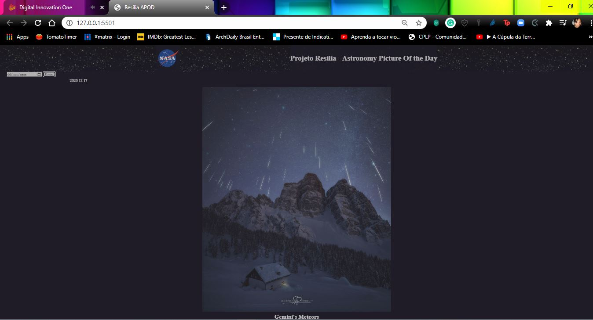

<h1>PROJETO RESILIA APOD<h1>

<h3>Projeto apresentado como exercício sobre modelagem MVC utilizando a API APOD da NASA, Turma #3 do Resilia Educação.</h3>

<h3>O exercício consiste em renderizar as imagens e descrições utilizadas no site da <a href='https://apod.nasa.gov/apod/astropix.html'>APOD</a></h3>

